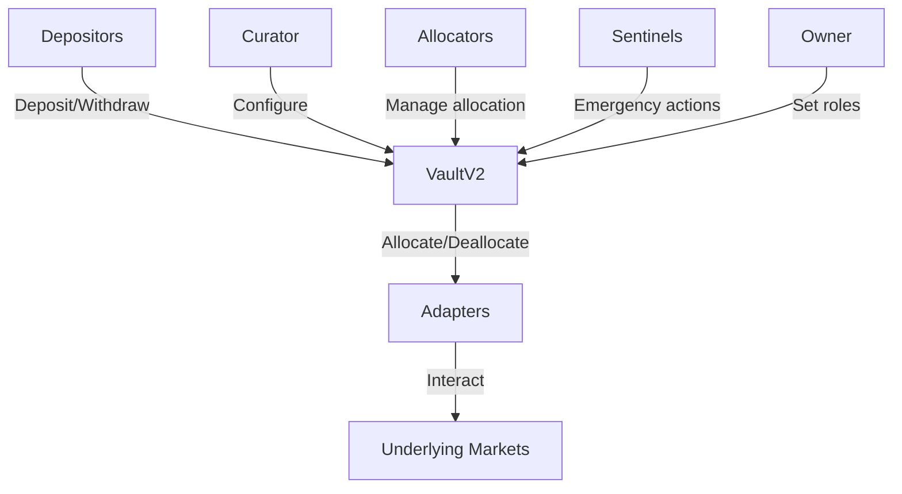

# Architecture

Morpho Vault V2 is built on a modular, role-based architecture that separates concerns between asset management, risk configuration, and market interactions. This design enables flexible yield strategies while maintaining strong security guarantees.

## System overview

The architecture consists of several key components working together:



## Core components

### VaultV2 contract

The main vault contract handles:

- **Asset management**: Deposits, withdrawals, and share accounting (ERC-4626)
- **Allocation coordination**: Routes assets to/from adapters
- **Interest accrual**: Tracks performance and realizes gains/losses
- **Risk enforcement**: Validates operations against caps and constraints
- **Fee collection**: Manages performance and management fees

```solidity
// From VaultV2.sol:190
contract VaultV2 is IVaultV2 {
    using MathLib for uint256;
    using MathLib for uint128;
    using MathLib for int256;

    /* IMMUTABLE */
    address public immutable asset;
    uint8 public immutable decimals;
    uint256 public immutable virtualShares;
```

<Note>
The vault uses **transient storage** and accrues interest/loss only once per transaction to optimize gas and prevent manipulation.
</Note>

### VaultV2Factory

The factory contract deploys new vault instances using CREATE2 for deterministic addresses:

```solidity
// From VaultV2Factory.sol:8
contract VaultV2Factory is IVaultV2Factory {
    mapping(address account => bool) public isVaultV2;
    mapping(address owner => mapping(address asset => mapping(bytes32 salt => address))) public vaultV2;

    function createVaultV2(address owner, address asset, bytes32 salt) 
        external 
        returns (address) {
        address newVaultV2 = address(new VaultV2{salt: salt}(owner, asset));
        
        isVaultV2[newVaultV2] = true;
        vaultV2[owner][asset][salt] = newVaultV2;
        emit CreateVaultV2(owner, asset, salt, newVaultV2);
        
        return newVaultV2;
    }
}
```

### Adapters

Adapters are separate contracts that hold positions on behalf of the vault and provide a standardized interface:

```solidity
// From IAdapter.sol:6
interface IAdapter {
    /// @dev Returns the market ids and the change in assets on this market.
    function allocate(bytes memory data, uint256 assets, bytes4 selector, address sender)
        external
        returns (bytes32[] memory ids, int256 change);

    /// @dev Returns the market ids and the change in assets on this market.
    function deallocate(bytes memory data, uint256 assets, bytes4 selector, address sender)
        external
        returns (bytes32[] memory ids, int256 change);

    /// @dev Returns the current value of the investments.
    function realAssets() external view returns (uint256 assets);
}
```

**Adapter responsibilities:**

- Enforce that only the vault can call allocate/deallocate
- Enter/exit markets only during allocate/deallocate calls
- Return correct risk IDs for cap enforcement
- Provide accurate real-time asset valuations
- Maintain approvals for the vault to transfer assets

**Available adapters:**

<CardGroup cols={2}>
  <Card title="Morpho Market V1 Adapter V2" icon="circle-1">
    Connects to Morpho Blue markets with adaptive curve IRM support
  </Card>
  <Card title="Morpho Vault V1 Adapter" icon="circle-2">
    Connects to MetaMorpho V1 vaults for nested strategies
  </Card>
</CardGroup>

### Adapter registry

An optional registry can restrict which adapters a vault can use:

```solidity
interface IAdapterRegistry {
    function isAdapter(address adapter) external view returns (bool);
}
```

<Info>
The adapter registry is useful when the curator role is abdicated, ensuring the vault will forever only use authorized adapter types.
</Info>

## Data flow

### Deposit flow

1. User calls `deposit()` or `mint()` with assets
2. Vault accrues interest (first call in transaction only)
3. Assets transferred from user to vault
4. Gates checked (if configured)
5. Assets forwarded to liquidity adapter (if configured)
6. Shares minted to user

### Withdrawal flow

1. User calls `withdraw()` or `redeem()` with shares
2. Vault accrues interest (first call in transaction only)
3. Gates checked (if configured)
4. Idle assets used first
5. Liquidity adapter deallocated if needed
6. Assets transferred to user
7. Shares burned

### Allocation flow

1. Allocator calls `allocate()` with adapter, data, and amount
2. Vault checks adapter is enabled
3. Assets transferred to adapter
4. Adapter allocates to underlying market
5. Adapter returns risk IDs and asset change
6. Vault updates allocations and checks caps
7. Event emitted for tracking

### Interest accrual flow

1. First interaction in a transaction triggers `accrueInterest()`
2. Vault loops through all adapters calling `realAssets()`
3. Gains and losses calculated
4. Losses realized immediately (share price decreases)
5. Gains limited by `maxRate` to prevent manipulation
6. Performance fees calculated on interest
7. Management fees calculated on principal
8. Fee shares minted to recipients
9. Total assets and last update timestamp recorded

<Warning>
If adapters consume too much gas in `realAssets()`, it could cause expensive interactions or denial of service. Keep adapter count reasonable.
</Warning>

## Storage architecture

### Immutable storage

```solidity
address public immutable asset;      // Underlying ERC20 asset
uint8 public immutable decimals;     // Vault share decimals
uint256 public immutable virtualShares; // Inflation attack protection
```

### Mutable storage

The vault maintains several categories of state:

**Roles:**
- `owner`: Single address controlling curator and sentinels
- `curator`: Single address managing configuration
- `isAllocator`: Mapping of allocator addresses
- `isSentinel`: Mapping of sentinel addresses

**Assets and shares:**
- `_totalAssets`: Last recorded total assets (uint128)
- `lastUpdate`: Timestamp of last interest accrual
- `firstTotalAssets`: Assets after first accrual in transaction
- Standard ERC20 balances and allowances

**Adapters:**
- `adapters`: Array of enabled adapter addresses
- `isAdapter`: Mapping for quick lookups
- `adapterRegistry`: Optional registry address

**Risk management:**
- `allocation`: Mapping from ID to current allocation
- `absoluteCap`: Mapping from ID to absolute cap
- `relativeCap`: Mapping from ID to relative cap (WAD)
- `forceDeallocatePenalty`: Mapping from adapter to penalty (WAD)

**Liquidity:**
- `liquidityAdapter`: Address of liquidity adapter
- `liquidityData`: Encoded data for liquidity adapter
- `maxRate`: Maximum rate of share price increase

**Timelocks:**
- `timelock`: Mapping from function selector to delay
- `abdicated`: Mapping from selector to abdication status
- `executableAt`: Mapping from call data to execution timestamp

**Fees:**
- `performanceFee`: Fee on interest (WAD, max 50%)
- `performanceFeeRecipient`: Recipient address
- `managementFee`: Fee on principal (WAD, max 5%/year)
- `managementFeeRecipient`: Recipient address

**Gates:**
- `receiveSharesGate`: Controls receiving shares
- `sendSharesGate`: Controls sending shares
- `receiveAssetsGate`: Controls withdrawing assets
- `sendAssetsGate`: Controls depositing assets

## Security design

### Immutability

All vault contracts are immutable with no upgrade mechanisms. This provides:

- Predictable behavior forever
- No governance risk from upgrades
- Simplified auditing and verification

### Role separation

Different roles have carefully scoped permissions:

- **Owner**: Cannot directly hurt depositors, but sets curator
- **Curator**: Cannot directly hurt depositors without timelocks
- **Allocators**: Can move funds within caps, set liquidity adapter
- **Sentinels**: Can only decrease risk (revoke, deallocate, decrease caps)

### Timelock protection

Critical curator actions are timelockable:

- Submission creates pending action
- Execution only possible after timelock expires
- Users can exit before changes take effect
- Functions can be abdicated (permanently disabled)

### Caps enforcement

Multi-layered risk limits:

- **ID-based system**: Group related risks
- **Absolute caps**: Hard limits per ID
- **Relative caps**: Proportional limits (soft on exit)
- **Checked on allocation**: Prevents exceeding limits

### Inflation attack protection

The vault uses virtual shares and decimal offset:

```solidity
virtualShares = min(1, 10^(18-decimals))
```

<Tip>
Vaults may need to be seeded with an initial deposit to fully protect against inflation attacks. See [OpenZeppelin's guide](https://docs.openzeppelin.com/contracts/5.x/erc4626#inflation-attack).
</Tip>

## Gas optimization

### Single accrual per transaction

Interest and losses are accounted only once per transaction using transient storage:

- First interaction triggers `accrueInterest()`
- `firstTotalAssets` tracks if already accrued
- Subsequent calls skip accrual
- Prevents flashloan manipulation

### Efficient allocation tracking

Allocations are updated incrementally:

- Only changed during allocate/deallocate
- Not updated on every interest accrual
- IDs removed when allocation reaches zero

## Design considerations

### Token requirements

The vault assumes the underlying asset:

- Is ERC-20 compliant (may omit return values)
- Doesn't re-enter on transfer
- Doesn't have transfer fees
- Balance changes match transfer amounts exactly

### Liveness requirements

For proper operation:

- Adapters must not revert on `realAssets()`
- Token must not revert on transfers with valid approvals
- Total assets and supply must stay below ~10^35
- Vault pinged at least every 10 years
- Adapters must not revert on deallocate if markets are liquid

<Warning>
Tokens with transfer fees are not supported and will cause accounting issues.
</Warning>

## Next steps

<CardGroup cols={2}>
  <Card title="Key features" href="/key-features">
    Learn about timelocks, gates, fees, and other features
  </Card>
  <Card title="Adapters" href="/concepts/adapters">
    Explore available adapters and integration patterns
  </Card>
</CardGroup>